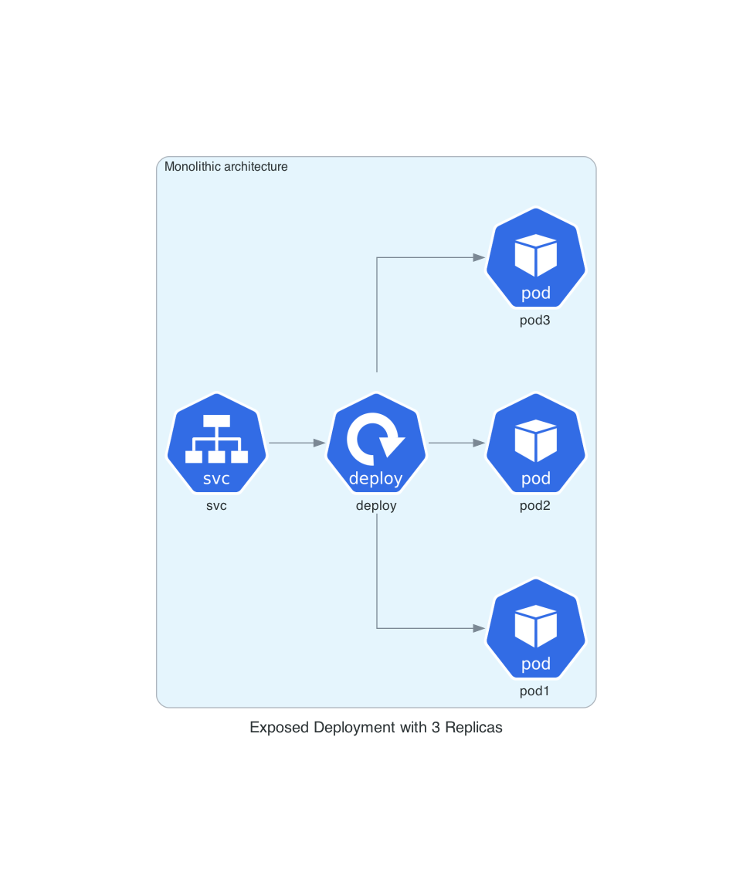
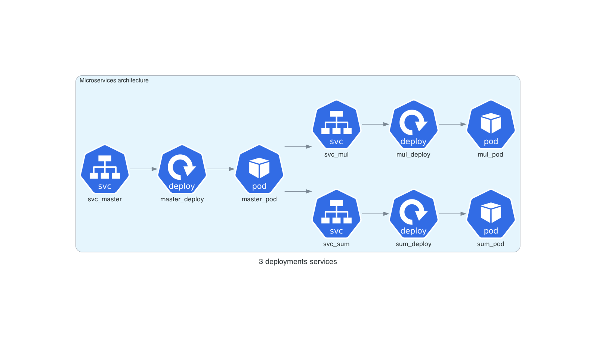

# kube-python-micro-services-example

### What is about
This project aims to serve as a didactic example, on how to structure a simple monolithic python app, then turn it into multiple microservices, then show how deploy each python micro service inside a kubernetes cluster, see the schemas below for both the architectures deployment

### Monolithic deployment architecture's schema 


### Microservices deployment architecture's schema 

### Pre-requisite
```
# as a pre-requisite you should have poetry installed, otherwise check poetry installation --> https://python-poetry.org/docs/#installation

# install dependencies with 

poetry install
```
### Usage (without kubernetes)

#### List available commands:

```
sh bin/cli.sh --help
```

#### Use sum functionality :

```
sh bin/cli.sh sum_cmd -e 3 -e 4
# result 
>>the result sum of elements : (3.0, 4.0) is 7.0
```

#### Use mul functionality :

```
sh bin/cli.sh mul_cmd -e 3 -e 4
# result 
>>the result mul of elements : (3.0, 4.0) is 12.0
```


#### Start monolithic architecture service :
```
sh bin/cli.sh service_monolithic
# result 
>>...
>>2022-03-31 15:58:54,011 - (werkzeug) - INFO -  * Running on http://10.0.2.15:8000/ (Press CTRL+C to quit)
>>...
```

#### Testing monolithic architecture service :

##### Ping
```
# ping the service
curl http://0.0.0.0:8000/
>>
{
  "message": "welcome to the example service", 
  "status": "success"
}
```

##### Testing sum functionality test
```
# curl post request to sum elements [1, 3, 5]
curl -X POST http://0.0.0.0:8000/sum -H "Content-Type: application/json" -d '{"list": [1, 3, 5]}'
>>
{
  "message": "my sum function", 
  "result": 9, 
  "status": "success"
}
```

##### Testing mul functionality
```
# curl post request to multiply elements [1, 3, 5]
curl -X POST http://0.0.0.0:8000/mul -H "Content-Type: application/json" -d '{"list": [1, 3, 5]}'
>>
{
  "message": "my mul function", 
  "result": 15, 
  "status": "success"
}
```

#### Start microservices architecture services :
```
# Each service should be started in an independent terminal

# start master microservice
sh bin/cli.sh ms_service_master
# result 
>>...
>>2022-03-31 17:25:11,711 - (werkzeug) - INFO -  * Running on http://10.0.2.15:8000/ (Press CTRL+C to quit)
>>...

# start mul microservice
sh bin/cli.sh ms_service_mul 
# result 
>>...
>>2022-03-31 17:27:27,107 - (werkzeug) - INFO -  * Running on http://10.0.2.15:8002/ (Press CTRL+C to quit)
>>...

# start sum microservice
sh bin/cli.sh ms_service_sum 
# result 
>>...
>>2022-03-31 17:28:27,107 - (werkzeug) - INFO -  * Running on http://10.0.2.15:8001/ (Press CTRL+C to quit)
>>...
```

#### Testing microservices architecture services :

```
# curl post request to multiply elements [1, 3, 5] (request to the master microservice)
curl -X POST http://0.0.0.0:8000/mul -H "Content-Type: application/json" -d '{"list": [1, 3, 5]}'
>>
{
  "message": "my mul function", 
  "result": 15, 
  "status": "success"
}

# curl post request to multiply elements [1, 3, 5]  (request to the mul microservice)
curl -X POST http://0.0.0.0:8002/mul -H "Content-Type: application/json" -d '{"list": [1, 3, 5]}'
>>
{
  "message": "my mul function", 
  "result": 15, 
  "status": "success"
}

# curl post request to sum elements [1, 3, 5] (request to the master microservice)
curl -X POST http://0.0.0.0:8000/sum -H "Content-Type: application/json" -d '{"list": [1, 3, 5]}'
>>
{
  "message": "my mul function",
  "result": 9,
  "status": "success"
}

# curl post request to sum elements [1, 3, 5]  (request to the mul microservice)
curl -X POST http://0.0.0.0:8001/sum -H "Content-Type: application/json" -d '{"list": [1, 3, 5]}'
>>
{
  "message": "my mul function",
  "result": 9,
  "status": "success"
}
```
### Usage (with kubernetes)


#### Setup

```
# install minikube from here https://minikube.sigs.k8s.io/docs/start/
#start minikube
minikube start
#export env vars to make minikube aware of your docker images
eval $(minikube docker-env)
# Build docker image
docker image build - rm -t mskube:0.0.0 -f Dockerfile .
```

#### Deploy monolithic architecture
```
kubectl apply -f K8S/monolithic
#forward nodeport
kubectl port-forward service/svc-monolithic 8000:8000
# test your deploy
curl http://localhost:8000  
{
  "message": "welcome to the example service", 
  "status": "success"
}
```

#### Deploy microservices architecture
```
# deploy 
kubectl apply -f K8S/mservices 
# forward nodeport
kubectl port-forward service/svc-master 8000:8000
# test your deploy
curl http://localhost:8000  
>>>
{
  "message": "welcome to the microservice master", 
  "status": "success"
}
>>>
```